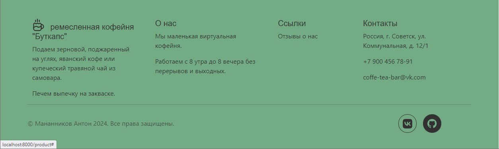
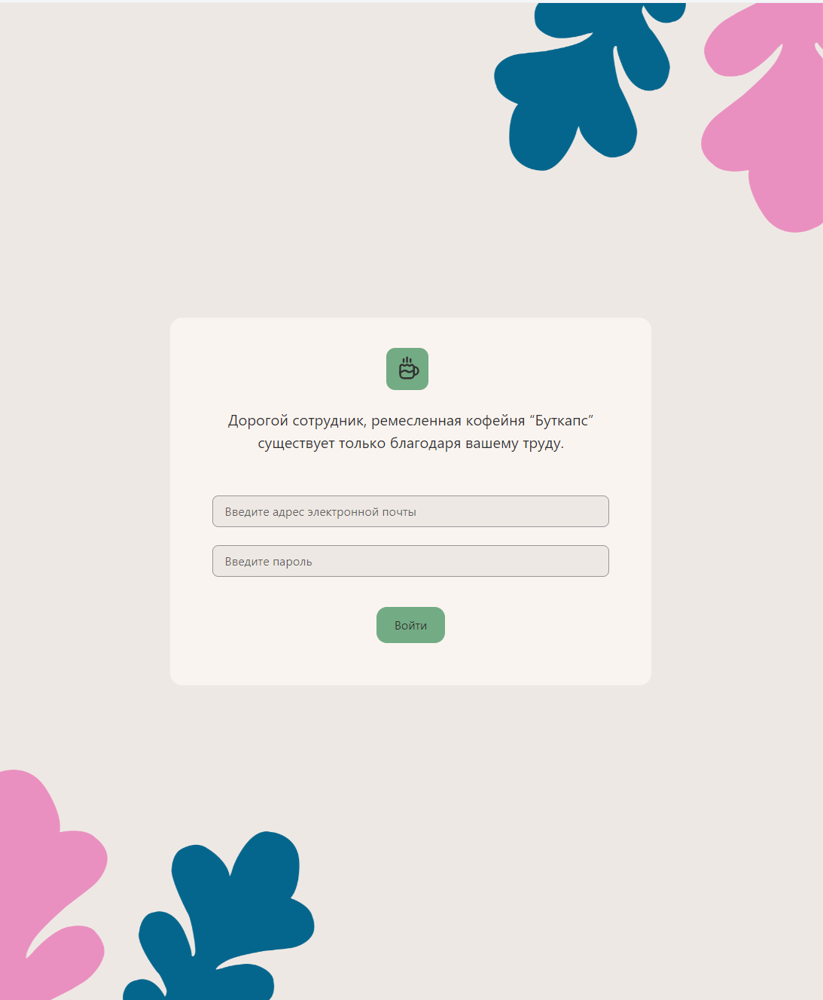
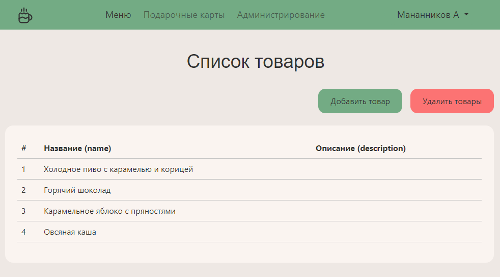
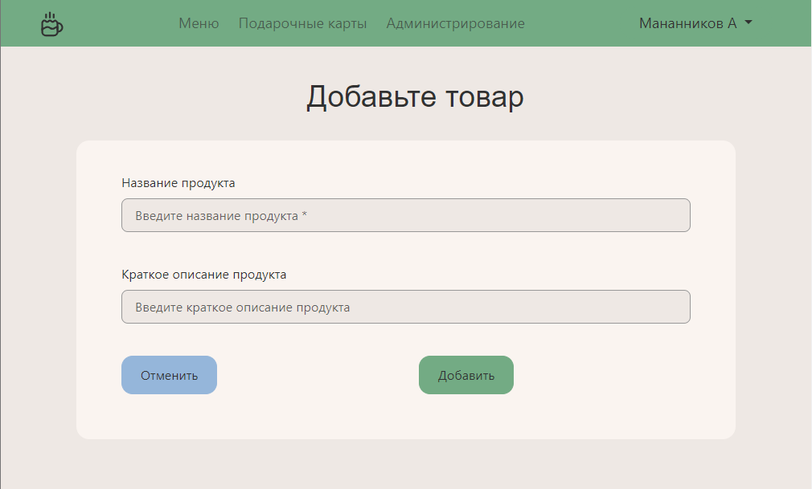
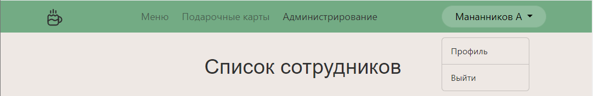
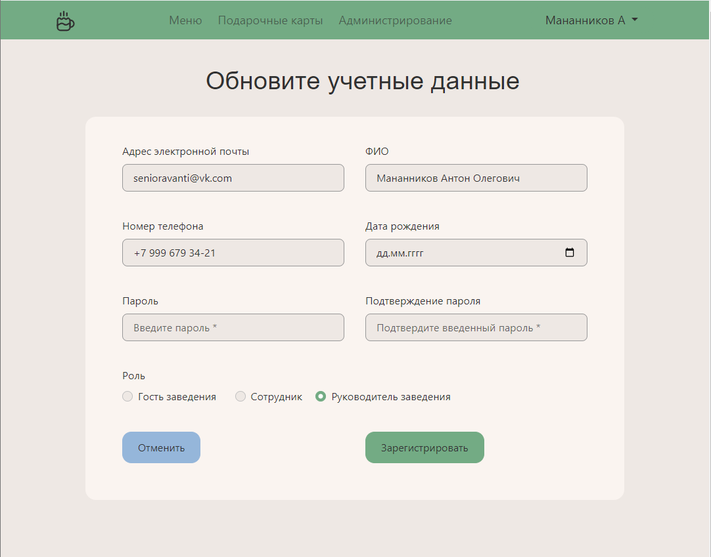
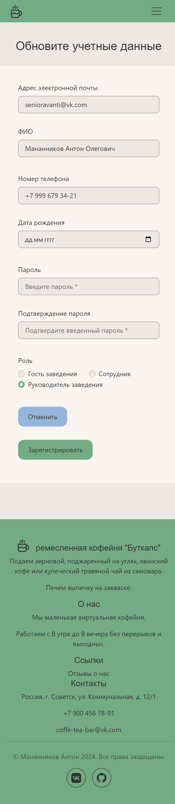

# Разработка ИС для ремесленной кофейни "Буткапс"

Стек: Java 22, Spring Boot, Thymeleaf, Docker, PostgreSQL, Telegram Bot.

## Скриншоты

Футер сайта

### /login 

Форма аутентификации пользователя

### /product 

Список товаров

product-form -> форма добавления или редактирования товара

Удалить один или несколько товаров 

Раскрывающийся список с двумя вариантами выбора "профиль = profile", "выйти = logout"

### /users

Список пользователей

user-form -> Форма регистрации и редактирования учетных данных пользователя
- Планшет или лаптоп 
- Сматфон